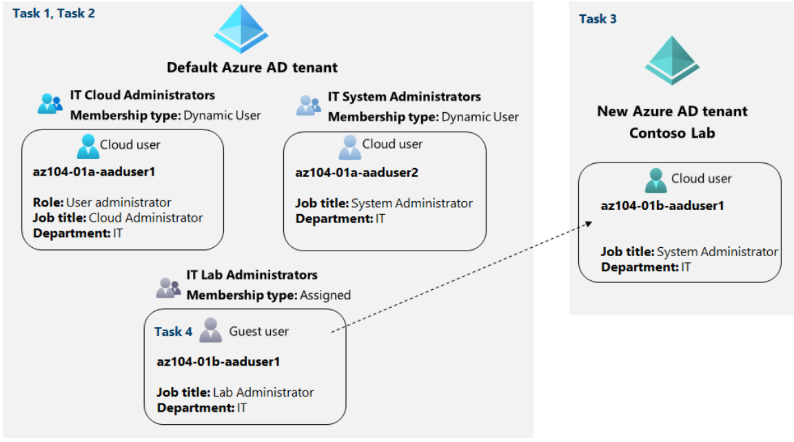

# Laboratorio 01: Administrar identidades de Azure Active Directory

## Escenario de laboratorio
Para permitir que los usuarios de Contoso se autentiquen mediante Azure AD, se le asignó la tarea de aprovisionar usuarios y cuentas de grupo. La membresía de los grupos debe actualizarse automáticamente en función de los títulos de trabajo de los usuarios. También debe crear un arrendatario de Azure AD de prueba con una cuenta de usuario de prueba y otorgar a esa cuenta permisos limitados para los recursos en la suscripción de Contoso Azure.

**Nota:** Hay disponible una simulación de laboratorio interactiva que le permite hacer clic en este laboratorio a su propio ritmo. Es posible que encuentre ligeras diferencias entre la simulación interactiva y el laboratorio alojado, pero los conceptos e ideas centrales que se demuestran son los mismos.

## Objetivos
En este laboratorio, usted:

Tarea 1: crear y configurar usuarios de Azure AD
Tarea 2: crear grupos de Azure AD con pertenencia dinámica y asignada
Tarea 3: crear un arrendatario de Azure Active Directory (AD) (opcional: problema del entorno de laboratorio)
Tarea 4: administrar usuarios invitados de Azure AD (opcional: problema del entorno de laboratorio)
Tiempo estimado: 30 minutos

## Diagrama de arquitectura

## Instrucciones
### Ejercicio 1
### Tarea 1: crear y configurar usuarios de Azure AD
En esta tarea, creará y configurará usuarios de Azure AD.

**Nota :** si utilizó anteriormente la licencia de prueba para Azure AD Premium en este arrendatario de Azure AD, necesitará un nuevo arrendatario de Azure AD y realizará la Tarea 2 después de la Tarea 3 en ese nuevo arrendatario de Azure AD.

1. Inicie sesión en el portal de **Azure**.

2. En Azure Portal, busque y seleccione **Azure Active Directory**.

3. En la hoja de Azure Active Directory, desplácese hacia abajo hasta la sección **Administrar**, haga clic en Configuración de usuario y revise las opciones de configuración disponibles.

4. En la hoja de Azure Active Directory, en la sección Administrar , haga clic en **Usuarios** y luego **haga clic en su cuenta de usuario para mostrar su configuración de perfil**.

5. Haga clic en **Editar**, en la sección Configuración, establezca la Ubicación de uso en **Estados Unidos** y haga clic en **Guardar** para aplicar el cambio.

**Nota :** esto es necesario para asignar una licencia de Azure AD Premium P2 a su cuenta de usuario más adelante en este laboratorio.

6. Vuelva a la hoja **Usuarios - Todos los usuarios** y luego haga clic en **+ Nuevo usuario** .

7. Cree un nuevo usuario con la siguiente configuración (deje los demás con sus valores predeterminados):

    | Entorno | Valor |
    |  -- | -- |
    | Nombre de usuario | az104-01a-aduser1 |
    | Nombre | az104-01a-aduser1 |
    | Déjame crear la contraseña | Activado |
    | Contraseña inicial | Proporcione una contraseña segura |
    | Ubicación de uso | Estados Unidos |
    | Título profesional | Administrador de la nube |
    | Departamento | IT |
    | | |

**Nota :** copie en el portapapeles el nombre principal de usuario completo (nombre de usuario más dominio). Lo necesitará más adelante en esta tarea.

8. En la lista de usuarios, haga clic en la cuenta de usuario recién creada para mostrar su hoja.

9. Revise las opciones disponibles en la sección **Administrar** y tenga en cuenta que puede identificar los roles de Azure AD asignados a la cuenta de usuario, así como los permisos de la cuenta de usuario para los recursos de Azure.

10. En la sección **Administrar** , haga clic en **Roles asignados** , luego haga clic en el botón **+ Agregar asignación** y asigne el rol de **administrador de usuarios** a **az104-01a-aaduser1** .

**Nota :** también tiene la opción de asignar roles de Azure AD al aprovisionar un nuevo usuario.

11. Abra una ventana del explorador de **InPrivate** e inicie sesión en Azure Portal con la cuenta de usuario recién creada. Cuando se le solicite que actualice la contraseña, cámbiela por una contraseña segura de su elección.

**Nota :** en lugar de escribir el nombre de usuario (incluido el nombre de dominio), puede pegar el contenido del Portapapeles.

12. En la ventana del navegador de **InPrivate** , en Azure Portal, busque y seleccione Azure Active Directory .

**Nota :** Si bien esta cuenta de usuario puede acceder al arrendatario de Azure Active Directory, no tiene acceso a los recursos de Azure. Esto es de esperar, ya que dicho acceso debería otorgarse explícitamente mediante el control de acceso basado en roles de Azure.

13. En la ventana del navegador de **InPrivate** , en la hoja de Azure AD, desplácese hacia abajo hasta la sección **Administrar , haga clic en Configuración de usuario** y tenga en cuenta que no tiene permisos para modificar ninguna opción de configuración.

14. En la ventana del navegador de **InPrivate** , en la hoja de Azure AD, en la sección **Administrar , haga clic en Usuarios y luego haga clic en + Nuevo usuario** .

15. Cree un nuevo usuario con la siguiente configuración (deje los demás con sus valores predeterminados):

    | Entorno | Valor |
    |  -- | -- |
    | Nombre de usuario | az104-01a-aduser2 |
    | Nombre | az104-01a-aduser2 |
    | Déjame crear la contraseña | Activado |
    | Contraseña inicial | Proporcione una contraseña segura |
    | Ubicación de uso | Estados Unidos |
    | Título profesional | Administrador de la nube |
    | Departamento | IT |
    | | |

16. Regístrese como usuario az104-01a-aaduser1 en Azure Portal y cierre la ventana del explorador de InPrivate.

### Tarea 2: crear grupos de Azure AD con pertenencia dinámica y asignada
En esta tarea, creará grupos de Azure Active Directory con membresía asignada y dinámica.

1. De vuelta en Azure Portal donde inició sesión con su **cuenta de usuario** , navegue de nuevo a la hoja **Información general** del arrendatario de Azure AD y, en la sección **Administrar , haga clic en Licencias** .

**Nota :** Se requieren licencias de Azure AD Premium P1 o P2 para implementar grupos dinámicos.

2. En la sección **Administrar , haga clic en Todos los productos** .

3. Haga clic en **+ Probar/Comprar** y active la prueba gratuita de Azure AD Premium P2.

4. Actualice la ventana del navegador para verificar que la activación se realizó correctamente.

**Nota :** Las licencias pueden tardar hasta 10 minutos en activarse. Continúe actualizando la página hasta que aparezca. No continúe hasta que se hayan activado las licencias.

1. En la hoja Licencias: todos los productos , seleccione la entrada Azure Active Directory Premium P2 y asigne todas las opciones de licencia de Azure AD Premium P2 a su cuenta de usuario y a las dos cuentas de usuario recién creadas.

2. En Azure Portal, vuelva a la hoja de arrendatario de Azure AD y haga clic en Grupos .

3. Use el botón + Nuevo grupo para crear un nuevo grupo con la siguiente configuración:

    | Entorno | Valor |
    |  -- | -- |
    | Tipo de grupo | Seguridad |
    | Nombre del grupo | Administradores de la nube de TI |
    | Descripción del Grupo | Administradores de la nube de TI de Contoso |
    | Tipo de membresía | Usuario dinámico |
    | | |

**Nota :** si la lista desplegable **Tipo de membresía está atenuada, espere unos minutos y actualice la página del navegador.**

4. Haga clic en **Agregar consulta dinámica** .

5. En la pestaña **Configurar reglas de la hoja Reglas de membresía dinámica** , cree una nueva regla con la siguiente configuración:

    | Entorno | Valor |
    |  -- | -- |
    | Propiedad | título profesional |
    | Operador | Igual |
    | Valor | Administradores de la nube de TI de Contoso |
    | | |

6. Guarde la regla haciendo clic en **+Agregar expresión y Guardar** . De vuelta en la hoja **Nuevo grupo , haga clic en Crear** .

7. De vuelta en la hoja **Grupos - Todos los grupos** del arrendatario de Azure AD, haga clic en el botón **+ Nuevo grupo** y cree un nuevo grupo con la siguiente configuración:

    | Entorno | Valor |
    |  -- | -- |
    | Tipo de grupo | Seguridad |
    | Nombre del grupo | Administradores de sistemas de TI |
    | Descripción del Grupo | Administradores de sistemas de TI de Contoso |
    | Tipo de membresía | Usuario dinámico |
    | | |

8. Haga clic en **Agregar consulta dinámica** .

9. En la pestaña **Configurar reglas de la hoja Reglas de membresía dinámica** , cree una nueva regla con la siguiente configuración:

    | Entorno | Valor |
    | -- | -- |
    | Propiedad	| Título profesional |
    | Operador | Igual |
    | Valor	| Administrador de sistema |
    | | |
10. Guarde la regla haciendo clic en **+Agregar expresión** y **Guardar** . De vuelta en la hoja **Nuevo grupo , haga clic en Crear** .

11. Vuelva a la hoja **Grupos - Todos los grupos** del inquilino de Azure AD, haga clic en el botón **+ Nuevo grupo** y cree un nuevo grupo con la siguiente configuración:

    | Entorno |	Valor |
    | -- | -- |
    | tipo de grupo	| Seguridad |
    | Nombre del grupo	| Administradores de laboratorio de TI |
    | Descripción del Grupo | Administradores del laboratorio de TI de Contoso |
    | Tipo de membresía	| Asignado |
    | | |

12. Haga clic en **Ningún miembro seleccionado** .

13. En la hoja **Agregar miembros , busque y seleccione los grupos Administradores de la nube de TI** y **Administradores del sistema de TI** y, de nuevo en la hoja **Nuevo grupo** , haga clic en **Crear** .

14. De vuelta en la hoja **Grupos - Todos los grupos** , haga clic en la entrada que representa el grupo **Administradores de la nube de TI** y, a continuación, muestre la hoja **Miembros** . Verifique que **az104-01a-aaduser1** aparezca en la lista de miembros del grupo.

**Nota :** es posible que experimente demoras con las actualizaciones de los grupos de miembros dinámicos. Para acelerar la actualización, vaya a la hoja del grupo, muestre su hoja de reglas de pertenencia dinámica , edite la regla que aparece en el cuadro de texto Sintaxis de la regla agregando un espacio en blanco al final y guarde el cambio.

15. Vuelva a la hoja **Grupos - Todos los grupos** , haga clic en la entrada que representa el grupo **Administradores del sistema de TI** y, a continuación, muestre la hoja **Miembros** . Verifique que **az104-01a-aaduser2** aparezca en la lista de miembros del grupo.

